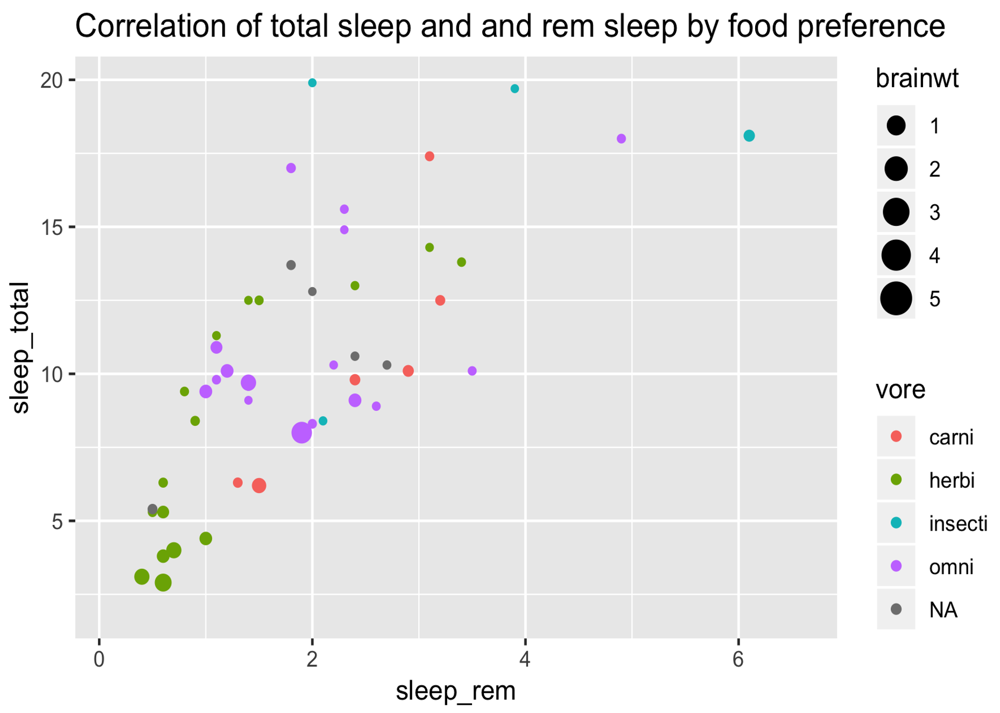

# A Kotlin grammar for scientific data visualization
 [  ](https://bintray.com/holgerbrandl/github/kravis/_latestVersion)
[](https://travis-ci.org/holgerbrandl/kravis)

Visualizing tabular and relational data is the core of data-science. `kravis` implements a grammar to create a wide range of plots using a standardized set of verbs.


The grammar implemented by `kravis` is inspired from [`ggplot2`](http://ggplot2.org/). The API is hightly similar to allow even reusing their excellent [cheatsheet.](https://www.rstudio.com/resources/cheatsheets/#ggplot2)
 Internally, `ggplot2` is used as rendering engine at the moment.

 R is required to used `kravis`, but to keep things simple, we provide bindings to docker and remove server instances.


[TOC levels=3]: # " "

- [Setup](#setup)
- [Examples](#examples)
- [The Grammar of Graphics](#the-grammar-of-graphics)
    - [Rendering and Display Modes](#rendering-and-display-modes)
    - [Plot Immutablity.](#plot-immutablity)
- [Output Modes](#output-modes)
- [Supported Data Input Formats](#supported-data-input-formats)
- [Execution Engines](#execution-engines)
    - [Iterator API](#iterator-api)
- [Custom Plots](#custom-plots)
- [References](#references)
- [Acknowledgements](#acknowledgements)


---

**This is an experimental API and is subject to breaking changes until a first major release**

---

## Setup


Add the following artifact to your gradle.build

```
compile "com.github.holgerbrandl:kravis:0.3"
```

You can also use [JitPack with Maven or Gradle](https://jitpack.io/#holgerbrandl/kravis/-SNAPSHOT) to build the latest snapshot as a dependency in your project.

```groovy
repositories {
    maven { url 'https://jitpack.io' }
}
dependencies {
        compile 'com.github.holgerbrandl:kravis:-SNAPSHOT'
}
```


## Examples

Let's start by analyzing mamalian [sleep patterns](https://ggplot2.tidyverse.org/reference/msleep.html)
```kotlin
import krangl.*
import kravis.*

sleepData
    .addColumn("rem_proportion") { it["sleep_rem"] / it["sleep_total"] }
        // Analyze correlation
    .ggplot(x = "sleep_total", y = "rem_proportion", color = "vore", size = "brainwt")
        .geomPoint(alpha = 0.7)
        .guides(size = LegendType.none)
        .title("Correlation between dream and total sleep time")
```


Or let's peek into the famous iris data-set
```kotlin
import kravis.* 
import krangl.irisData 

irisData.ggplot("Species" to x, "Petal.Length" to y)
    .geomBoxplot()
    .geomPoint(position = PositionJitter(width = 0.1), alpha = 0.3)
    .title("Petal Length by Species")
```


Find more examples in our gallery **{comding soon}**.


## The Grammar of Graphics

`ggplot2` and thus `kravis` implement a **grammar for graphics** to build plots with

> `layers` + `aesthetics` + `coordinates system` + `transformations` + ` facets`

Which reads as `one or more layers` + `map variables from data space to visual space` + `coordinates system` + `statistical transformations` + `optional facets`. That's the way.


### Rendering and Display Modes

`kravis` builds on top of `krangl` and `ggplot2` from R. The latter it will access via different backends like a local installation, docker or Rserve.


### Plot Immutablity.

Plots are -- similar to krangl data-frames -- immutable.

```

```

## Output Modes

`kravis` autodetects the environment. It

1. will use an javaFX powered graphics device for rendering when running in interactive mode.
2. will render directly in a multi-page pdf when running in headless mode
3. will render directly into jupyter notebooks.

## Supported Data Input Formats

1. It can handle any `Iterable<T>` as input and allows to create plots using a type-save builder DSL

2. It can handle any kind of tabular data via [krangl](https://github.com/holgerbrandl/krangl) data-frames


## Execution Engines

1. Local R

This is the default mode which can be configured by using

```kotlin
R_ENGINE = LocalR()
```

### Iterator API

Instead of using `krangl` data-frames, it is also possible to use any `Iterable<T>` to create plots. Essentially we first digest it into a table and use it as data source for visualization Here's an example:

```kotlin
// map data attributes to aesthetics 
 val basePlot = sleepPatterns.ggplot(
    x = { brainwt },
    y = { bodywt },
    alpha = { sleep_total }
)

// add layers
basePlot.geomPoint()
    .scaleXLog10()
    .scaleYLog10("labels" to "comma")
    .title("Correlation of body and brain weight")
    .show()
```


## Custom Plots

Since `kravis` just mimics some parts of `ggplot2`, and because user may want to create more custom plots we do support preambles (e.g. to define new geoms) and custom layer specs.

Example

```kotlin
irisData.ggplot(x = "Species", y = "Sepal.Length", fill = "Species")
    .addPreamble("""devtools::source_url("https://git.io/fAiQN")""")
    .addCustom("""geom_flat_violin(scale = "count", trim = FALSE)""")
    .geomDotplot(binaxis = "y", dotsize = 0.5, stackdir = "down", binwidth = 0.1, position = PositionNudge(-0.025))
    .theme(legendPosition = "none")
    .labs(x = "Species", y = "Sepal length (cm)")
```


## References

You don't like it? Here are some other projects which may better suit your purpose. Before you leave, consider dropping us a [#ticket](https://github.com/holgerbrandl/krangl/issues/ticket) with some comments about whats missing, badly designed or simply broken in `kravis`.

GGplot Wrappers

* [gg4clj](https://github.com/JonyEpsilon/gg4clj) Another ggplot2 wrapper written in java


Other JVM visualization libraries ordered by -- personally biased -- usefullness

* [SmilePlot](https://github.com/haifengl/smile#smileplot) provides data visualization tools such as plots and maps for researchers to understand information more easily and quickly.
* [XChart](https://github.com/timmolter/XChart) is a light-weight Java library for plotting data
* [data2viz](https://github.com/data2viz/data2viz) is a multi platform data visualization library with comprehensive DSL
* [Kubed](https://github.com/hudsonb/kubed/) is a Kotlin library for manipulating the JavaFX scenegraph based on data.
* [TornadoFX](https://github.com/edvin/tornadofx/wiki/Charts) provides some Kotlin wrappers around JavaFX
* [plotly-scala](https://github.com/alexarchambault/plotly-scala) which provides scala bindings for plotly.js and works within jupyter
* [breeze-viz](https://github.com/scalanlp/breeze/tree/master/viz) which is a
Visualization library backed by Breeze and JFreeChart
* [grafana](https://grafana.com/) is an open platform for beautiful analytics and monitoring
* [Jzy3d](http://www.jzy3d.org/) is an open source java library that allows to easily draw 3d scientific data: surfaces, scatter plots, bar charts

Other
* https://github.com/bloomberg/bqplot is a plotting library for IPython/Jupyter Notebooks


Vega-lite based
* [Vegas](https://github.com/vegas-viz/Vegas) aims to be the missing MatPlotLib for Scala + Spark
* [altair](https://github.com/altair-viz/altair) provides declarative statistical visualization library for Python
* [vega-embed](https://github.com/vega/vega-embed) allows to publish Vega visualizations as embedded web components with interactive parameters.
* [hrbrmstr/vegalite](https://github.com/hrbrmstr/vegalite) provides R ggplot2 "bindings" for Vega-Lite


## Acknowledgements

Thanks to vega-lite team for making this project possible.

Thanks to the ggplot2 team for providing the best data vis API to date.

