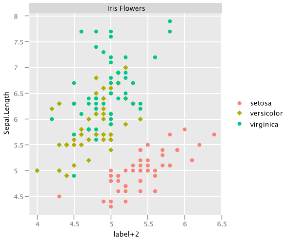

# A Kotlin grammar for scientific data visualization
 [  ](https://bintray.com/holgerbrandl/github/kravis/_latestVersion)
[](https://travis-ci.org/holgerbrandl/kravis)

Visualizing tabular and relational data is the core of data-science. `kravis` implements a grammar to create a wide range of plots using a standardized set of verbs.


The grammar implemented by `kravis` is inspired from [`ggplot2`](http://ggplot2.org/). The API is hightly similar to allow even reusing their excellent [cheatsheet.](https://www.rstudio.com/resources/cheatsheets/#ggplot2)
 Internally, `ggplot2` is used as rendering engine at the moment.

 R is required to used `kravis`, but to keep things simple, we provide bindings to docker and remove server instances.


---

**This is an experimental API and is subject to breaking changes until a first major release**

---

## Setup


Add the following artifact to your gradle.build

```
compile "com.github.holgerbrandl:kravis:0.2"
```

You can also use [JitPack with Maven or Gradle](https://jitpack.io/#holgerbrandl/kravis/-SNAPSHOT) to build the latest snapshot as a dependency in your project.

```groovy
repositories {
    maven { url 'https://jitpack.io' }
}
dependencies {
        compile 'com.github.holgerbrandl:kravis:-SNAPSHOT'
}
```

## Idea


Example

```kotlin
irisData.ggplot("Species" to x, "Petal.Length" to y)
    .geomBoxplot()
    .geomPoint(position = PositionJitter(width = 0.1), alpha = 0.3)
    .title("Petal Length by Species")
```


## Output Modes

`kravis` autodetects the environment. It

1. will use an javaFX powered graphics device for rendering when running in interactive mode.
2. will render directly in a multi-page pdf when running in headless mode
3. will render directly into jupyter notebooks.

## Supported Data Input Formats

1. It can handle any `Iterable<T>` as input and allows to create plots using a type-save builder DSL

2. It can handle any kind of tabular data via [krangl](https://github.com/holgerbrandl/krangl) data-frames

```kotlin
import com.github.holgerbrandl.kravis.*

irisData
    .plot()
    .x("width + 2") { it["Sepal.Width"] + 2 } 
    .y { "Sepal.Length" }
    .color { "Species" }
    .title("Iris Flowers")
    .addPoints()
    .show()
```




## Execution Engines

1. Local R

This is the default mode which can be configured by using

```kotlin
R_ENGINE = LocalR()
```

## Other More experimental APIs in kravis

Because of its experimental nature `kravis` also implements several ways to do datavis within the JVM.

### Vega-Lite Spec Builder

First, it implements a DSL wrapper around [vega-lite ](https://vega.github.io/vega-lite/):

```kotlin
val movies = DataFrame.fromJson("https://raw.githubusercontent.com/vega/vega/master/test/data/movies.json")

plotOf(movies) {
    mark = Mark(circle)

    encoding(x, "IMDB_Rating", binParams = BinParams(10))
    encoding(y, "Rotten_Tomatoes_Rating", bin = true)
    encoding(size, aggregate = Aggregate.count)
}

```


### Simplified Builder API for XCharts

Finally, `kravis` implements a ore kotlinesque wrapper around [XChart](https://github.com/knowm/XChart). This API is more constrained compared vega-DSL the and thus easier to use. However, it lacks some of the flexibility provided by the vega-DSL wrapper. Example:

```kotlin
data class User(val name: String, val birthDay: LocalDate, val sex: String, val height: Double) {}

val users = listOf(
    User("Max", LocalDate.parse("2007-12-03"), "M", 1.89),
    User("Jane", LocalDate.parse("1980-07-03"), "F", 1.67),
    User("Anna", LocalDate.parse("1992-07-03"), "F", 1.32)
)

plotOf(users)
    .x("Year of Birth") { birthDay.year }
    .y("Height (m)") { height }
    .color { sex }
    .title("user stats")
    .addPoints()
    .show()

```


## References


GGplot Wrappers
* [gg4clj](https://github.com/JonyEpsilon/gg4clj) Another ggplot2 wrapper written in java


Other JVM visualization libraries
* [SmilePlot](https://github.com/haifengl/smile#smileplot) provides data visualization tools such as plots and maps for researchers to understand information more easily and quickly.
* [XChart](https://github.com/timmolter/XChart) is a light-weight Java library for plotting data
* [data2viz](https://github.com/data2viz/data2viz) is a multi platform data visualization library with comprehensive DSL
* [Kubed](https://github.com/hudsonb/kubed/) is a Kotlin library for manipulating the JavaFX scenegraph based on data.
* [TornadoFX](https://github.com/edvin/tornadofx/wiki/Charts) provides some Kotlin wrappers around JavaFX
* [Jzy3d](http://www.jzy3d.org/) is an open source java library that allows to easily draw 3d scientific data: surfaces, scatter plots, bar charts
* [plotly-scala](https://github.com/alexarchambault/plotly-scala) which provides scala bindings for plotly.js and works within jupyter
* [grafana](https://grafana.com/) is an open platform for beautiful analytics and monitoring
* [breeze-viz](https://github.com/scalanlp/breeze/tree/master/viz) which is a
Visualization library backed by Breeze and JFreeChart

Other
* https://github.com/bloomberg/bqplot is a plotting library for IPython/Jupyter Notebooks


Vega-lite based
* [Vegas](https://github.com/vegas-viz/Vegas) aims to be the missing MatPlotLib for Scala + Spark
* [altair](https://github.com/altair-viz/altair) provides declarative statistical visualization library for Python
* [vega-embed](https://github.com/vega/vega-embed) allows to publish Vega visualizations as embedded web components with interactive parameters.
* [hrbrmstr/vegalite](https://github.com/hrbrmstr/vegalite) provides R ggplot2 "bindings" for Vega-Lite


## Acknowledgements

Thanks to vega-lite team for making this project possible.

Thanks to the ggplot2 team for providing the best data vis API to date.

