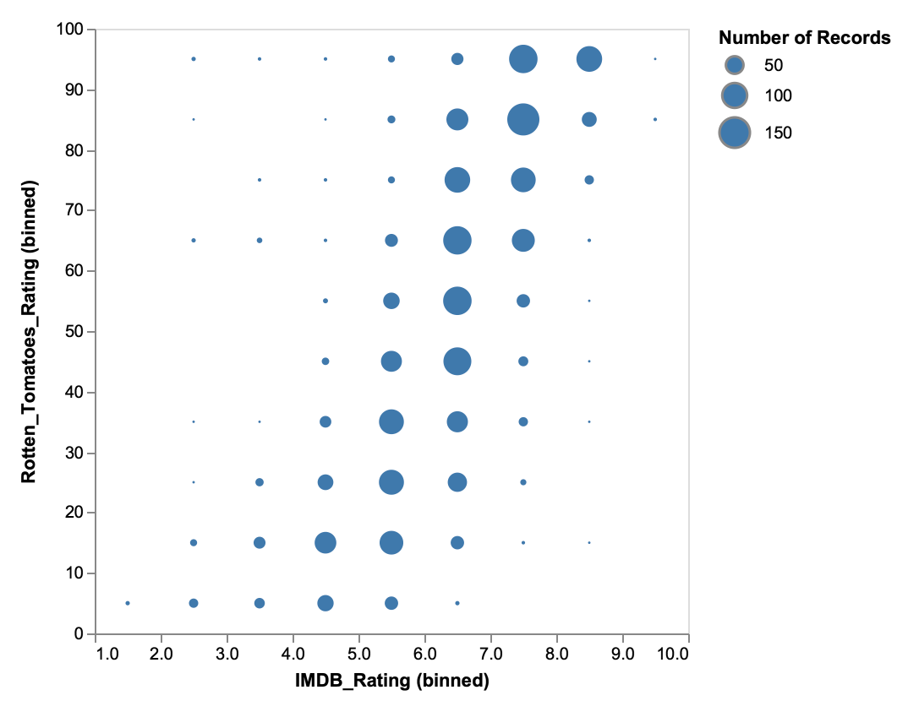

## Other More experimental visualzation wrapper APIs in `kravis`


Because of its explorative experimental nature `kravis` also implements several ways to do datavis within the JVM.

---

**These modes are just kept here as reference, there an longer maintained or developed**

---


### Vega-Lite Spec Builder

First, it implements a DSL wrapper around [vega-lite ](https://vega.github.io/vega-lite/):

```kotlin
val movies = DataFrame.fromJson("https://raw.githubusercontent.com/vega/vega/master/test/data/movies.json")

plotOf(movies) {
    mark = Mark(circle)

    encoding(x, "IMDB_Rating", binParams = BinParams(10))
    encoding(y, "Rotten_Tomatoes_Rating", bin = true)
    encoding(size, aggregate = Aggregate.count)
}

```




### Simplified Builder API for XCharts

Finally, `kravis` implements a ore kotlinesque wrapper around [XChart](https://github.com/knowm/XChart). This API is more constrained compared vega-DSL the and thus easier to use. However, it lacks some of the flexibility provided by the vega-DSL wrapper. Example:

```kotlin
data class User(val name: String, val birthDay: LocalDate, val sex: String, val height: Double) {}

val users = listOf(
    User("Max", LocalDate.parse("2007-12-03"), "M", 1.89),
    User("Jane", LocalDate.parse("1980-07-03"), "F", 1.67),
    User("Anna", LocalDate.parse("1992-07-03"), "F", 1.32)
)

plotOf(users)
    .x("Year of Birth") { birthDay.year }
    .y("Height (m)") { height }
    .color { sex }
    .title("user stats")
    .addPoints()
    .show()

```


```kotlin
import com.github.holgerbrandl.kravis.*

irisData
    .plot()
    .x("width + 2") { it["Sepal.Width"] + 2 } 
    .y { "Sepal.Length" }
    .color { "Species" }
    .title("Iris Flowers")
    .addPoints()
    .show()
```


